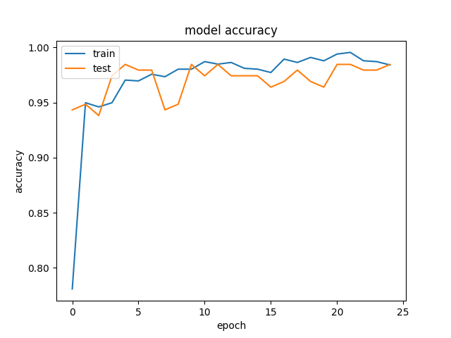
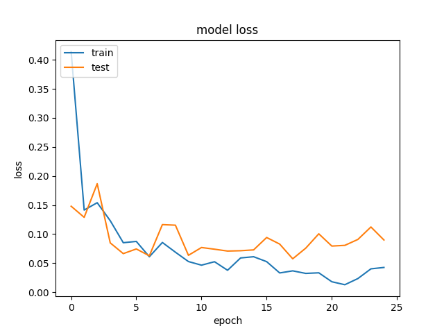
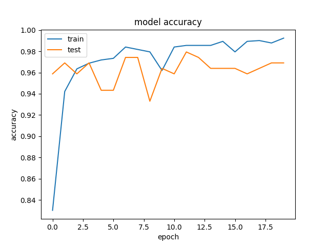
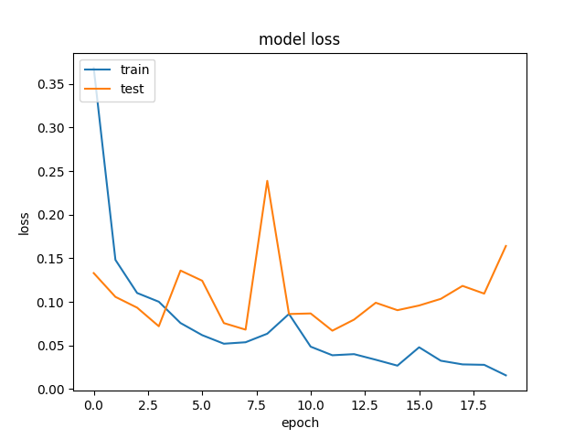

 😷 Face Mask Detection System

Real-time face mask detection using a Convolutional Neural Network (CNN) and OpenCV. Detects faces in a live webcam feed and classifies each one as **MASK** ✅ or **NO MASK** ❌ in real time.


---

 📌 Overview

This project trains a CNN from scratch to classify face images as masked or unmasked, then runs that model live against your webcam feed. Faces are located with OpenCV's Haar cascade classifier, cropped, passed through the trained model, and the result is drawn directly on the video frame — a green box + "MASK" label, or a red box + "NO MASK" label — with a live timestamp overlay.

✨ Features

- 🎥 **Real-time detection** via webcam using OpenCV
- 🧠 **Custom CNN** trained from scratch (no external pretrained backbone required)
- 📦 **Data augmentation** (shear, zoom, horizontal flip) for better generalization
- 🖼️ **Live bounding boxes** with color-coded mask status and timestamp
- 📊 **Training visualizations** for accuracy and loss across epochs

🧠 Model Architecture

```
Input (150x150x3)
   │
Conv2D(32, 3x3, ReLU) → MaxPooling2D
   │
Conv2D(32, 3x3, ReLU) → MaxPooling2D
   │
Conv2D(32, 3x3, ReLU) → MaxPooling2D
   │
Flatten
   │
Dense(100, ReLU)
   │
Dense(1, Sigmoid)  →  Mask / No Mask
```

- **Optimizer:** Adam
- **Loss:** Binary Crossentropy
- **Metric:** Accuracy

 📊 Results

Trained for 20–25 epochs, reaching **~97–99% training accuracy** with test accuracy tracking closely.

<table>
<tr>
<td></td>
<td></td>
</tr>
<tr>
<td></td>
<td></td>
</tr>
</table>

🗂️ Project Structure

```
Face Mask Detection System/
├── Dataset/
│   ├── train/
│   │   ├── with_mask/
│   │   └── without_mask/
│   └── test/
│       ├── with_mask/
│       └── without_mask/
├── TrainModelInit.py          # Trains the CNN and saves maskmodel.h5
├── FaceMaskInit.py            # Real-time webcam mask detection
├── haarcascade_frontalface_default.xml  # OpenCV pretrained face detector
├── maskmodel.h5                # Trained model weights
├── requirements.txt
└── README.md
```

 ⚙️ Setup

```bash
git clone https://github.com/guldagadnikita/Face_Mask_Detection_System.git
cd Face_Mask_Detection_System
pip install -r requirements.txt
```

 🚀 Usage

**Train the model:**
```bash
python TrainModelInit.py
```

**Run real-time detection** (requires a webcam and a trained `maskmodel.h5`):
```bash
python FaceMaskInit.py
```
Press **`q`** to quit the live detection window.
🛠️ Tech Stack

| Category | Tools |
|---|---|
| Language | Python |
| Deep Learning | TensorFlow, Keras |
| Computer Vision | OpenCV, Haar Cascade |
| Data Handling | NumPy |
| Visualization | Matplotlib |

 📝 Notes

- The dataset isn't included in this repo (see `.gitignore`) due to size. Structure your own dataset as `Dataset/train/{with_mask,without_mask}` and `Dataset/test/{with_mask,without_mask}` to retrain.
- `temp.jpg` is a scratch file overwritten every detection frame and is git-ignored.
 🤝 Contributing

Contributions, issues, and feature requests are welcome — feel free to open an issue or submit a pull request.

 📄 License

This project is open source. Add a `LICENSE` file (e.g. MIT) if you'd like to formally license it.

---

<p align="center">Made with 🧠 + ☕ by <a href="https://github.com/guldagadnikita">guldagadnikita</a></p>
